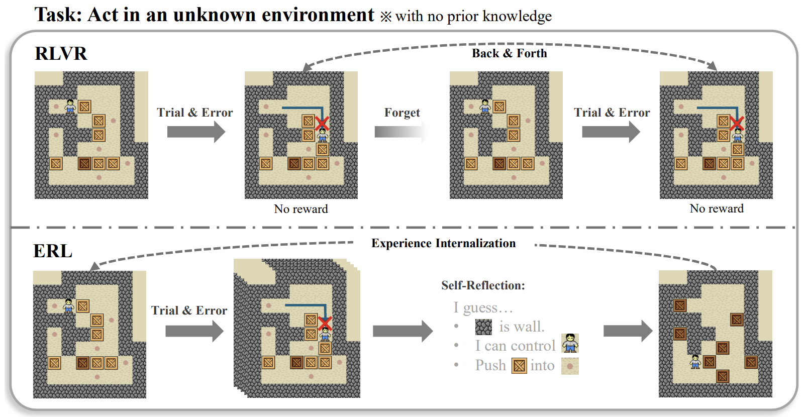
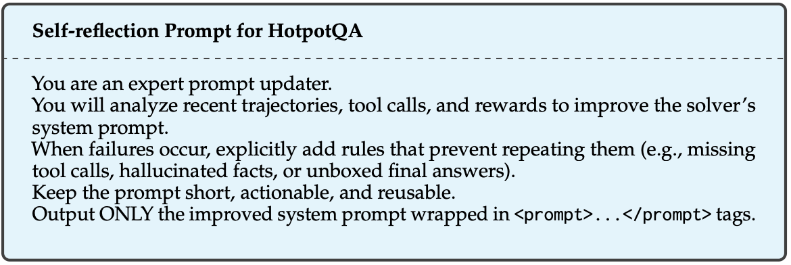
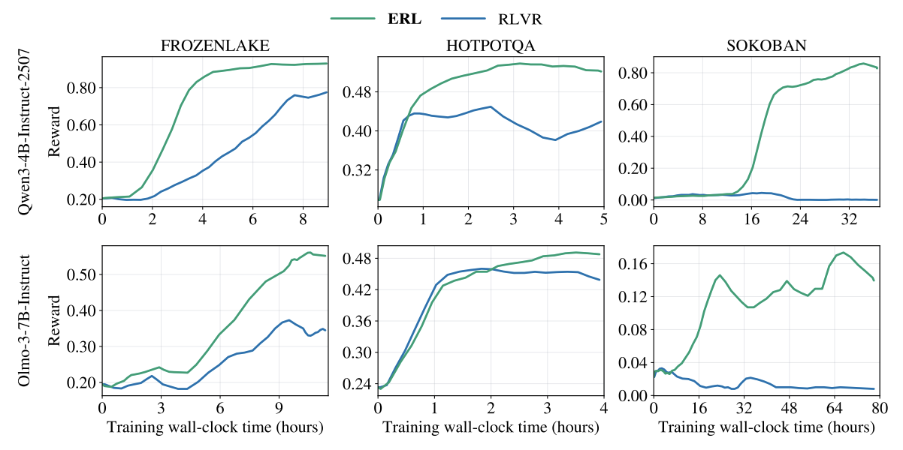

Last week I saw that Microsoft put out a paper with an interesting title, [Experiential Reinforcement Learning](https://arxiv.org/pdf/2602.13949). Honestly, I think the content itself has quite a few holes, and there was no code so I couldn't run it, but it gave me various things to think about regarding reinforcement learning. Let me organize my thoughts along with a review.

## Reinforcement learning is actually expensive

When you actually do LLM training, there's no way to push performance to the extreme other than reinforcement learning. This is because, among the training methods for LLMs, RL is the only one that takes **the LLM performance that the user has in mind** as its objective. *Pre-training and SFT learn a proximal objective called PPL, which has high correlation with LLM performance but is not the performance itself.*

However, **rollout is expensive, and reward is too simple.**

The biggest bottleneck when applying on-policy RL to LLMs is generation. It will vary depending on which downstream task you use and whether it's reasoning/non-reasoning, but you can consider it to take up roughly 50~60% or more. It's one of the limitations of the autoregressive approach, but on-policy RL in particular has a severe bottleneck because it has to generate data at every step.
And yet, **the feedback you get from that result** is only a simple **scalar reward**.

Think about how wasteful this is. In the case of a reasoning model, the generated response actually contains rich information: what reasoning path it built, what mistakes it made, which points failed to properly receive reward, and so on. Unlike general RL, an LLM's trajectory is composed of natural language, so it can be analyzed, and that analysis can be given back as an input condition. **This is possible because everything is composed of natural language.**

But existing RLVR (Reinforcement Learning with Verifiable Rewards) ignores all of this information and uses only the simple signal of "right/wrong." In the end, the model has to implicitly infer "what on earth did I do wrong?" And this requires more diverse exploration and more training time.

## ERL (Experiential RL) review

*The paper has this figure, and I think it's really well drawn. It intuitively expresses the idea well!*

ERL ultimately raised training efficiency and performance by analyzing the trajectory and providing information that can reduce exploration (trial & error). The paper calls this the Experience-Reflection-Consolidation Loop.

Let's look at the ERL process with an example based on a reasoning task called HotpotQA. *For reference, HotpotQA can be seen as a QA that uses tool-calling (information retrieval) to find the answer to a question, and it's a multi-hop QA problem that requires retrieving and combining various pieces of information to answer.*

### ERL process

**Stage 1: First Attempt**

$$y^{(1)} \sim \pi_\theta (\cdot | x) $$
$$ (f^{(1)}, r^{(1)}) \sim \text{Env}(x, y^{(1)}) $$

First, it makes an initial attempt. From the LLM policy $\pi_\theta$, it samples a response $y^{(1)}$ for the input $x$, and receives a reward $r^{(1)}$ for it. If you use something like an LLM judge, you also get feedback $f^{(1)}$ about the judging process.

The input (system prompt) used for HotpotQA is as follows.

**Stage 2: Self-Reflection**

$$ \Delta \sim \pi_{reflection} (\cdot | x, y^{(1)}, f^{(1)}, r^{(1)}, m) $$

It generates a reflection on what went wrong in the model's first response and how it should be fixed. `m` is the cross-episode memory, which reuses information gained throughout the entire RL training process by storing previously effective reflections.

In the paper, they used $\pi_\theta$ as $\pi_{reflection}$. But in my opinion, it's fine to use an external LLM too. Rather, given the importance of the reflection's quality, using a SOTA model would best improve training efficiency.

Reflection extracts information by giving a system prompt like this.

**Stage 3: Second Attempt**

$$y^{(2)} \sim \pi_\theta (\cdot | x, \Delta) $$
$$ (f^{(2)}, r^{(2)}) \sim \text{Env}(x, y^{(2)}) $$

It gives the reflection as conditioned input and generates a response again. If the reflection $\Delta$ helped with the policy's behavior correction, a higher-quality (*i.e.* $r^{(2)} > r^{(1)}$) answer would have been generated.

And if $r^{(2)}$ is above a certain threshold $\tau$, the reflection is stored in memory `m` ($m \leftarrow \Delta$).

**Stage 4: Internalization**

First, it does one RL update using the first-attempt and second-attempt data obtained so far. Then, based on the data obtained from the second attempt, it applies an SFT loss and does one more update.

$$\mathcal{L}_{\text{distill}}(\theta)
=
- \mathbb{E} \left[
\mathbb{I}\left( r^{(2)} > 0 \right)
\log \pi_{\theta}\left( y^{(2)} \mid x \right)
\right]$$

You can see it as doing SFT with better data than before by using the original input rather than the conditioned input. It's not actually distillation, but since $y^{(2)}$ can also be viewed as a teacher model response, I think that's why they used this term.

*Applying this distillation loss may look like cheating when compared to existing RL, but applying RL and SFT together is common in LLMs. It's for training stability, and there are cases where the SFT loss prevents RL performance degradation.*

### Experimental results

In the paper, they compared results against RLVR on FrozenLake, Sokoban, and HotpotQA. FrozenLake and Sokoban are puzzle-like problems, and here they solved them using an LLM policy. Since they're not LLM tasks, people often define a state-action model rather than an LLM and apply RL. The RL algorithm used was GRPO.

There are three points worth noting in the experimental results.

**1. Fast performance improvement early in training**

It's not written in detail in the paper (it's a shame there wasn't an ablation study), but in my opinion it's because of the distillation loss. I think it's good that, rather than separating out SFT, they melded it in as a way to reuse the data generated during RL.

In general, RL is best used for squeezing out performance. There's a reason the term "SFT cold-start" exists; exploring with a random policy is truly the epitome of inefficiency. The standard practice is to appropriately leverage SFT early on to raise performance to a certain level, and then apply RL.

**2. High final performance**

This is a bit unusual. Normally I'd think that when you intentionally influence exploration, convergence may speed up, but it can fall into a local minimum. The reason ERL nonetheless has high performance, I think, lies in reward variance.

Empirically, the most important signal in RL is **completely different responses to the same prompt**. To get good gradients, high-reward responses and low-reward responses need to be mixed in a balanced way (especially in GRPO). ERL forcibly makes it possible to obtain a set of responses of differing quality for the same prompt through the second attempt. I think this is the point.

**3. Where the effect is greatest**

FrozenLake and Sokoban are actually hard to solve easily even with LLM capability. Probably even humans find them easy when looking at images, but when given as text they're relatively not so easy to solve. In particular, the 7B-class models used in the paper can't solve them right away. And since it's a sparse reward where you get no reward at all unless you succeed even once, exploration also takes a tremendous amount of time. In these kinds of cases, the effect is large. On the other hand, HotpotQA basically has a certain level of capability to begin with, so the exploration cost is lower, and the performance improvement from ERL was also not large.

Therefore, if it's unknown dynamics that the LLM is seeing for the first time, and the reward is sparse to the degree of just getting the answer right or wrong, ERL can be a very effective method. You can consider that problems usually solved with text don't apply. (Limitation)

## Wrap-up

When using reinforcement learning in LLMs, the problem is clear.

> **In on-policy RL, rollout is the most expensive operation, and it's wasteful to compress the rich information that comes out of it into a scalar reward.**

ERL proposed an intuitive idea as a solution.

> **Extract the information contained in the generated response as an explicit reflection, and internalize the successful corrections into the base policy.**

Broadly speaking, this is no different from what has been happening in the AI model industry so far.

1. Deploy a new model
2. Discover problems while using it in a real environment
3. Through prompting or agent systems, users themselves raise performance via reflection
4. Do SFT or run RL with this data that users have refined
5. Deploy the improved model again
6. **Repeat 1-5**

ERL is one of the methods to turn this cycle into a self-training loop. There's talk that Anthropic has fully automated this cycle, and personally I'm sooooo curious about how they did it.
