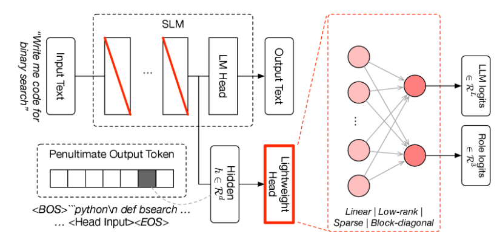
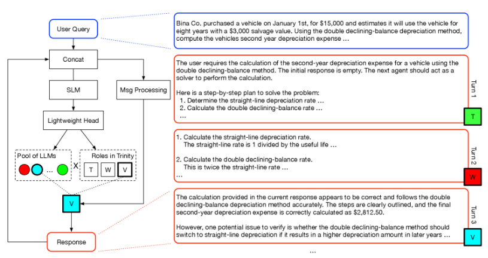
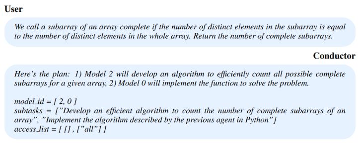

Mythos, Fable 금지 사태와 동시에 괜찮은 성능의 모델들 기사가 많이 보이기 시작했다. 아마도 기회라고 생각했겠지. 그 중에서 Sakana AI의 Fugu가 눈에 들어왔다. 사실 AI4Science 쪽에서 잘한다는 얘기는 들었는데, 갑자기 frontier AI 모델이라고 해서 궁금해졌다. 좀 찾아보니까 온전한 자체 LLM 이라기보다는 자체 router를 학습해서 frontier LLM 답변들을 잘 조합한 end-to-end 성능 극대화에 초점을 맞춘 모델이었다. 

[🐡 Sakana Fugu](https://sakana.ai/fugu/) / [📄 Technical Paper](https://arxiv.org/pdf/2606.21228)

## Sakana Fugu에 대해서 알아보자

일단 Fugu는 복어라는 뜻이다 (왜 복어를 썼는지는 잘 모르겠다. 복어가 맛있어서 그런가? 강해서 그런가?) 사용자는 Sakana Fugu 모델 하나를 부르는 것처럼 쓰지만, 내부에서는 여러 프론티어 LLM(GPT-5.5, Claude-Opus-4.8, Gemini-3.1-Pro 같은)이 팀으로 협업하게 되고, 하나의 orchestrator가 이를 조율한다. 이 orchestrator가 Fugu의 핵심 모듈이다. orchestrator는 문제를 직접 풀지 않는다. 대신 "이 일은 누구에게 맡길지", "어떤 순서로 붙일지"를 결정한다. 당연하게도 **워커로 쓰이는 대형 LLM들은 전혀 학습하지 않는다.**.

Fugu는 두 가지 버전이 있는데

- **Fugu**: 일상용. latency와 성능의 균형을 맞춘 모델로 입력마다 워커 하나만 고른다.
- **Fugu-Ultra**: 고난도용. 답의 품질을 최우선으로, 여러 에이전트를 엮은 워크플로를 짠다.

그리고 Fugu-Ultra는 SWE-Bench Pro, LiveCodeBench, GPQA-Diamond 같은 벤치마크에서 frontier 모델들을 앞선다. 사실 harness 랑 다를게 없다. frontier 모델들을 조합해서 일하는 방법을 구체화 시켜줬으니 벤치마크가 상승하는건 당연하지. 그러나 약간 다른 건, harness같은 인간의 추상화과정으로 만들어진 워크플로우가 아니라, 학습을 통해서 이루어진 특정 objective를 극대화시킨 워크플로우라는 것이다. 그냥 이렇게 하면 좋아요! 가 아니라 이렇게 하면 수학적으로 좋아진다는 것을 보장합니다! 라는 것이다. (두 개는 엄연히 다르다)

아무튼 갑자기 이 모델들이 덜컥 나온건 아니고, Fugu는 Trinity라는 논문에서, Fugu-Ultra는 Conductor라는 논문에서 왔다. 하나씩 개념적으로 뜯어보자.

## Sakana Trinity

[Sakana Trinity](https://arxiv.org/html/2512.04695v3)는 Sakana Fugu의 의 근간이 된 논문이다. 여기서 orchestrator는 Qwen3-0.6B라는 작은 백본을 사용해서 어떤 LLM을 호출할지, 해당 LLM에게 어떤 role을 부여할지 classification 하는 모듈이다. 

Role은 Thinker (T), Worker (W), 그리고 Verifier (V) 로 이루어지고, LLM은 GPT-5, Gemini-2.5-pro, Claude-4-Sonnet, Gemma-3-27B-It, DeepSeek-R1-Distill-Qwen-32B, Qwen3-3-32B 을 사용했다. 

Thinker는 전략을 짜고, Worker는 실제로 코드나 계산을 만들고, Verifier는 결과를 검증해서 통과 여부를 판정한다. 매 턴 이 세 역할 중 하나를 배정하면서 최대 5턴을 돈다. 최종적으로는 Verifier가 승인하면 끝.

대박 간단한 방법이기는 한데, 딱 봐도 오버피팅되거나 학습이 아예 안될 것 같다는 느낌이 들기 마련이다. 토큰 sequence를 예측하는 것이 아니다보니, 전체 episode 하나에서 고작 학습 가능한 classification signal이 5개밖에 안나오기 때문이다. 이런 경우에는 복잡한 알고리즘을 사용하지 않고 더 근본 ML 알고리즘을 쓰는게 더 용이하다. Trinity는 강화학습(RL) 대신 **evolution strategy (sep-CMA-ES)**을 쓴다. 논문에서는 실험적으로 RL을 사용했을 때 sparse signal 때문에 학습이 제대로 되지 않음을 보였다. 반면 evolution strategy를 통해 학습된 Trinity 모델은 gradient 없이 "이 파라미터 조합이 저 조합보다 나았나"라는 순위만 보고 움직이니까, 이런 상황에 더 강건하고 볼 수 있다.

Sakana Fugu는 Sakana Trinity의 모델 형태를 그대로 가져간다. 따라서 단순한 sequential 워크플로우로 문제를 풀게 되고, router latency 또한 낮기 때문에 빠르게 답을 얻어야 할 때 적합하다.

## Sakana Conductor

[Sakana Conductor](https://arxiv.org/abs/2512.04388)는 **텍스트를 생성하여 워크플로우를 만드는** orchestrator 라고 볼 수 있다. 스탭마다 Model과 Role 하나만 선택했던 Trinity와는 다르게, 여러 개의 model과 role을 동시에 호출할 수 있다.

워크플로우의 한 스텝은 세 가지로 구성된다.

- **Model ID**: 이 하위 작업을 어느 모델에게 맡길지
- **Subtask**: 해당 모델에게 어떤 구체적인 지시를 내릴지
- **Access list**: 이전 스텝들의 결과 중 어떤 걸 이 워커의 컨텍스트에 넣을지

이 access list 덕분에 단순한 best-of-N부터 순차 체인, 트리 구조까지 다양한 협업 위상(topology)을 짤 수 있다. 실제로 논문 예시를 보면, 잎 노드에서 Gemini와 GPT가 각각 독립적으로 답을 시도하고, 트리 머리의 Gemini가 둘을 종합해서 완전한 정답을 만든다. 어려운 디버깅 지점에서만 Opus를 투입하는 식의 협업도 나온다. 위 그림의 예시를 보면 agent 2에게 알고리즘을 설계하도록 하고, agent 0에게 이전 응답을 context 로 받아서 Python 구현하라는 워크플로우를 구성하는 것을 볼 수 있다.

Conductor 학습은 RL을 사용한다 (논문에서는 GRPO 사용). 여기서도 마찬가지로 sparse reward 문제가 있기는 하다. 보상은 최종 결과가 맞는지 틀리는지에 따라서 binary reward를 제공하고, 중간에 워크플로우 스탭 파싱 가능 여부에 따른 포맷 reward를 함께 제공한다. 여전히 ORM (Outcome Based Reward Model) 이기 때문에 학습의 효율 자체는 떨어질 수 밖에 없다. 그럼에도 불구하고 Trinity 처럼 ES를 선택하지 않은 이유는, 7B 사이즈의 모델 (Qwen-2.5-7B)을 사용했기 때문이다. ES로 학습하기에는 모델이 너무 크다. 그리고 사실 classification task가 아니라 token sequence distribution을 학습하는 것이고, Instruct tuning이 이미 된 모델을 finetuning 하는 것이었기 때문에 RL 방법론을 적용해도 충분했다.

Frontier 모델들은 Trinity와 동일하게 GPT-5, Gemini-2.5-pro, Claude-4-Sonnet, Gemma-3-27B-It, DeepSeek-R1-Distill-Qwen-32B, Qwen3-3-32B를 사용했다. RL 학습은 960 sample 정도를 사용해 200 step 정도만 학습했는데, 비용을 줄이기 위해서 Frontier 모델들의 output token을 극도로 제한했다고 한다. (그런데도 성능이 잘 나온게 신기하다)

Sakana Fugu-Ultra 는 Sakana Conductur를 기반으로 동작한다. 사실 conceptual 하게 보면 Conductor는 Trinity를 포함한다. Graph형태로 워크플로우를 구성할 수 있으므로 sequential 형태는 그 부분집합이기 때문이다. 아무튼 orchestrator 자체의 response 생성 시간도 소요되고 전체 워크플로우도 더 복잡하기 때문에, latency는 크더라도 성능이 우선시되는 task에 사용하면 좋다.

## Sakana Fugu와 나만의 생각

아무튼 Sakana Fugu 모델들은 기존의 Frontier 모델들을 잘 routing 하여 SOTA 성능을 이끌어내는 orchestrator를 **수학적으로 optimal 하게** 학습시켰다. 갑자기 SOTA 모델들의 사용이 제한될 수도 있는 상황에서 이런 방식의 ensemble method는 결국 강건하게 성능을 유지할 수 있는 방법이 될지도 모른다. 그러나...

### 학습된 router는 모델 변경에 취약하다

Sakana Fugu의 Trinity와 Conductor 모두 고정된 LLM을 기반으로 학습된 모델들이다. 워커를 **integer index**로 식별하는 것에서 알 수 있는데, GPT나 Claude는 몇 달마다 버전이 바뀌고, 모델이 사라지기도 하고, 새 모델이 나오기도 한다. 따라서 사실은 모델의 버전이 올라가기만 해도 기존에 학습했던 분포와는 달라지게 되는 단점이 있다. 게다가 특정 모델을 router LLM pool masking 해버렸을 떄 기존의 Trinity 나 Conductor가 제대로 동작할지 여부에 대한 ablation study 가 진행되지 않았다.

### 그렇다면 Harnessing이 답일까?

실제로 업계 주류는 학습된 router가 아니다. Anthropic의 "[Building Effective Agents](https://www.anthropic.com/engineering/building-effective-agents)"는 라우팅을 LLM 프롬프팅으로 하는 워크플로 패턴으로 제시한다. OpenAI Agents SDK의 [handoff](https://openai.github.io/openai-agents-python/handoffs/) 패턴도, [OMC](https://github.com/yeachan-heo/oh-my-claudecode)의 subagent 위임도 전부 "LLM에게 instruction을 주고 판단하게 하기"다. 학습이 없다. [Devin Fusion](https://cognition.com/blog/devin-fusion)도 마찬가지로, fine-tuning이나 end-to-end 학습 없이 harness 설계와 prompt engineering으로 sidekick 구조를 만든다.

이 방식의 장점은 명확하다. 어떤 LLM들을 사용할지 **자연어 설명으로 식별**하니까, 모델이 바뀌면 설명만 갈아 끼우면 된다. 재학습이 필요 없다. 앞서 말한 "모델 변경 취약성"이 자연스럽게 사라진다. 또 Thinker/Worker/Verifier 말고도 다른 role 이 필요한 워크플로우를 구성할 수도 있다. 여러모로 자유로운 워크플로우 구성이 가능하다는 장점이 있다. 그러나 **이렇게 구성한 방식이 좋다는 보장이 없다**. 단지 Practical한 잘 되는 것을 보여줄 뿐이다.

그래서 나는 현실적인 최적 경로가 이렇지 않을까 싶다. **일단 harnessing과 prompt engineering으로 빠르게 굴린다. 그러면서 "어떤 입력에 어떤 라우팅이 좋았는지" 데이터를 모은다. 그 데이터가 충분히 쌓이면, 그때 router를 학습한다.** 처음부터 sparse reward 로 router를 학습하려 애쓰는 것보다, harness로 라벨을 만들어 supervised learning으로 학습하는게 훨씬 빠르고 안정적일 것이다. Sakana도 결국 기본 Fugu는 SFT로 워밍업하고 ES와 RL로 미세조정하는 파이프라인을 쓴다.

## 마무리

아무튼 옛날부터 곰곰히 생각해 왔지만, harnessing과 prompt engineering에는 근본적인 약점이 있다. **이게 optimal이라는 보장이 전혀 없다는 것.** 결국은 이게 되네? 이거 될걸? 이라는 접근 말고는 명쾌하게 설명하기는 어려운 부분이 있다. 실제로 Devin Fusion 블로그를 보면 "many rounds of tuning", "artful engineering", "with the right prompting" 같은 표현이 나온다. 결국 손으로 깎고 또 깎아서 "이 정도면 되네" 하는 지점을 찾은 거다. 학습 기반 방법이 적어도 목적함수를 최대화한다는 방향성을 가진 것과 대조적이다. Harness는 방향성 없이 그냥 잘 되는 지점에 멈춘다.

결국 내가 도달한 지점은 이거다. Router를 처음부터 학습하는 건 모델 변경에 취약하고 reward도 너무 희소하다. 그러니 harnessing으로 시작해서 데이터를 모아 SFT로 넘어가는 게 현실적이다. 하지만 그 시작점인 harness와 prompt 자체가 optimal이라는 보장이 없다는 게 계속 마음에 걸린다. 따라서 **optimal한 harness나 prompt를 찾는 방법이 있으면 좋겠다.** 지금은 사람이 감으로 깎고 있지만, 이걸 원리적으로 탐색하거나 보장하는 방법이 나온다면, 위의 딜레마가 상당 부분 풀릴 것 같다. Harness로 최적 라우팅을 찾고, 그 라벨로 router를 학습한다면, 모델 변경에도 강하고 최적성도 어느 정도 담보되는 시스템이 될 테니까.
